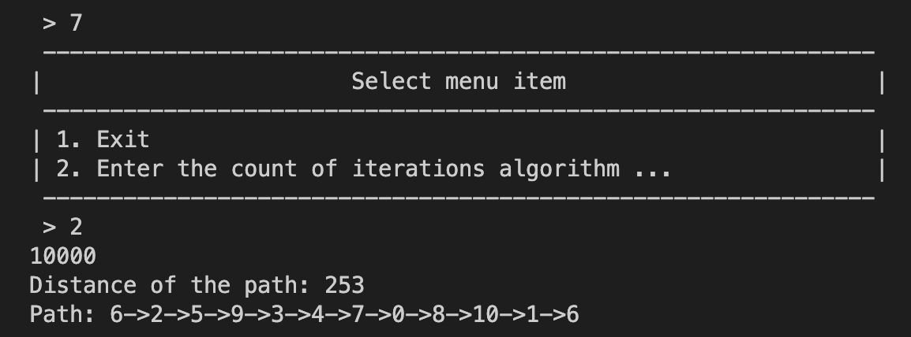

# Ant colony optimization algorithm in Qt/CPP

This project provides an implementation of the Ant Colony Optimization (ACO) algorithm to solve the Traveling Salesman Problem (TSP). The ACO algorithm is a metaheuristic approach to solve combinatorial optimization problems based on the behavior of ants. The TSP is a classic optimization problem that consists of finding the shortest path that visits a set of cities and returns to the starting city. 

This project is developed in C++17 and follows the Google C++ Style Guide. It provides a console interface to test the functionality of the implemented libraries.

## Getting Started

### Prerequisites

To build and run the project, the following tools must be installed on your system:
* CMake (version 3.15 or higher)
* C++ compiler supporting the C++17 standard
* Make

### Build and Install

To build and install the project, run the following commands:

```
cmake -S . -B ./build
cmake --build ./build
```


This will generate the executable file `ACOAlgorithms` in the `build` directory.

### Usage

#### Console Interface

The console interface provides the following functionality:

### Main menu


1. Loading the original graph from a file

2. Run the Atn Colony Optimization


#### ACO Algorithm

To run the ACO algorithm, execute the following command in the `build` directory:

```
./build/ACOAlgorithms.app
```

This will run the ACO algorithm to solve the TSP problem for a user-defined matrix. The user can set the matrix for the TSP problem and the number of executions N. The program will display the results of each of the algorithms for the specified matrix and measure the time it takes to execute N times an ACO algorithm applying parallelism and a usual ant algorithm for the user-defined matrix. The obtained time will be displayed.

This will load the graph from the file specified by `<path-to-graph-file>` and display the menu with the available options. To select an option, enter the corresponding number and follow the instructions on the screen.

## License

This project is licensed under the MIT License - see the [LICENSE](LICENSE) file for details.
